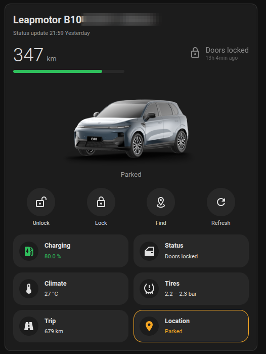

# Leapmotor Card

A Lovelace custom card for Home Assistant that shows a Leapmotor vehicle as a
compact card: range, battery and lock state at the top, a row of action
buttons, and a grid of groups — charging, status, climate, tires, trip and
location — each opening a navigable sub-view in place of the grid rather than
below it.

Built for a Leapmotor B10 running the
[kerniger/leapmotor-ha](https://github.com/kerniger/leapmotor-ha) integration.



That is the card on a real dashboard, in the Home Assistant dark theme, with
the vehicle's name blurred out. The photograph of the car is not part of this
card: it comes from the integration's own picture entity, and the card falls
back to a drawn silhouette when no picture is available. The amber outline on
the Location tile is the card reporting that the position it has is stale —
which the integration flags, and which this card shows rather than hides.

Tapping any tile replaces the grid with that group's sub-view, with a close
button and previous/next arrows; the header shrinks to a single line while one
is open.

## Requirements

- Home Assistant **2026.8** or later (developed and tested against
  2026.8.3).
- The [kerniger/leapmotor-ha](https://github.com/kerniger/leapmotor-ha)
  integration already installed and configured, with your vehicle added as
  a device.

## Installation — HACS

This repository is not part of the HACS default list, so HACS has to be told
about it as a **custom repository**. The badge below does exactly that in one
click: it opens your own Home Assistant, asks you to confirm, and adds this
repository to HACS.

[](https://my.home-assistant.io/redirect/hacs_repository/?owner=fapgomes&repository=ha-leapmotor-card&category=plugin)

On the page it opens, press **Download**. The Lovelace resource is registered
automatically.

The same thing by hand, if you prefer:

1. In HACS, open the three-dot menu and choose **Custom repositories**.
2. Add this repository's URL with type **Dashboard** (the label HACS shows for
   the category it calls `plugin` internally — older HACS versions called it
   *Lovelace*).
3. Download **Leapmotor Card** from HACS.

> **A tagged release is required.** `dist/` is listed in `.gitignore`, so
> the built `leapmotor-card.js` file does not exist in the repository
> tree. HACS resolves the file from a GitHub release asset first, and only
> falls back to the repository tree afterwards — with no tagged release,
> neither source has the file and the card cannot be installed. Install a
> tagged version (`vX.Y.Z`), not an arbitrary commit or branch.

## Installation — manual

1. Download `leapmotor-card.js` from a
   [tagged release](https://github.com/fapgomes/ha-leapmotor-card/releases)
   (or build it yourself — see [Development](#development)).
2. Copy it to `config/www/leapmotor-card/leapmotor-card.js`.
3. Go to **Settings → Dashboards → three-dot menu → Resources** and add a
   new resource:
   - URL: `/local/leapmotor-card/leapmotor-card.js`
   - Resource type: **JavaScript module**

## Configuration

Minimal configuration:

```yaml
type: custom:leapmotor-card
```

Full example with every option:

```yaml
type: custom:leapmotor-card
device: a1b2c3d4e5f6a7b8c9d0e1f2a3b4c5d6
name: My Leapmotor
language: en
image: auto
actions:
  - unlock
  - lock
  - trunk
  - windows
  - findVehicle
  - sunshade
confirm_actions:
  - unlock
grid:
  - charging
  - status
  - climate
  - tires
  - group: trip
    icon: mdi:road-variant
    summary: recentDays
tire_range: [2.0, 2.6]
range_tap_action:
  action: more-info
entities:
  rangeLive: sensor.my_car_live_remaining_range_km
```

| Option | Type | Default | Description |
| --- | --- | --- | --- |
| `device` | string | *(auto-detected)* | Device ID, or any entity ID belonging to the car. May be omitted if only one Leapmotor device exists in your Home Assistant instance; if there is more than one, `device` is required. |
| `name` | string | device name | Overrides the name shown in the card header. |
| `language` | string | `hass.locale.language` (falls back to `en` if unsupported) | Forces the card's language regardless of the Home Assistant UI language. Supported values: `pt`, `en`. |
| `image` | `auto` \| `entity` \| `none` \| URL | `auto` | `auto` shows the vehicle's `entity_picture` when available and falls back to the built-in silhouette; `entity` shows only the picture from the vehicle's image entity (no silhouette fallback); `none` hides the image entirely; any other string is used as a literal image URL. |
| `actions` | list of action IDs | `[unlock, lock, trunk, windows, findVehicle, sunshade]` | Which action buttons appear in the action row. Valid IDs: `unlock`, `lock`, `trunk`, `windows`, `sunshade`, `quickCool`, `quickHeat`, `defrost`, `findVehicle`, `unlockCharger`, `refresh`, `climate`, `steeringWheelHeat`, `mirrorHeat`, `batteryPreheat`. |
| `confirm_actions` | list of action IDs | `[unlock]` | Subset of `actions` (or any of the same valid action IDs) that ask for confirmation before calling the service. |
| `grid` | list | *(all groups the car supports)* | Which groups the grid shows, in order. Each entry is either a group name (`charging`, `status`, `climate`, `tires`, `trip`, `location`) or a mapping with `group` plus any of `icon`, `title` and `summary`. An empty list hides the grid. With no `grid:` at all, every group whose entities the car reports is shown. |
| `tire_range` | list of 2 numbers | `[2.0, 2.6]` | The tire pressure range treated as normal, in bar. A pressure outside it marks the tire, and the grid tile, as a warning. Check the sticker on the driver's door pillar for your car and tire size — the default is narrow and a correctly inflated car may fall outside it. |
| `range_tap_action` | action mapping | `{action: more-info}` | What tapping the range number in the header does — see [Tapping the header](#tapping-the-header) below. |
| `entities` | map of logical name → entity ID | *(none)* | Overrides automatic entity resolution for individual logical names — see [Entity overrides](#entity-overrides) below. |

| Group | `summary` values (first is the default) |
| --- | --- |
| `charging` | `charge`, `battery`, `limit`, `phase`, `eta` |
| `status` | `lock`, `openings`, `trunk` |
| `climate` | `interior`, `target`, `state` |
| `tires` | `range`, `min`, `worst` |
| `trip` | `odometer`, `recentDays`, `consumption` |
| `location` | `activity`, `zone`, `age` |

The battery tile's default summary, `charge`, gives the percentage and the
charging state together — `60.3 % · Not plugged in`, `28.8 % · Slow charging`
— because the percentage on its own said nothing about the cable. Use
`battery` for the percentage alone, or `phase` for the charging state alone.
Tile summaries are a single line and are cut with an ellipsis when they do
not fit, so the percentage comes first.

`setChargeLimit` and `setClimate` are absent from the `actions`/
`confirm_actions` list above: neither works as an action-row button, because
their service call needs a value (the charge limit, the target temperature)
that only their own control — the charging section's slider, the climate
panel's stepper — can supply.

`findVehicle` triggers the vehicle's horn: the integration itself describes
its underlying `find_car` action as "Trigger the horn/find-vehicle action".

The sunshade's position is not exposed as an entity, so `sunshade` is not a
toggle — a toggle would have to lie about the current state. It opens a
single position control (0–10) instead, and there is no way to stop the
sunshade mid-travel, because the integration exposes no stop service.

The visual editor (opened from Lovelace's card picker) covers device, name,
language, image, actions, confirm actions, and a grid block: a checkbox per
group plus up/down arrows to reorder the ones checked. `icon`, `title`,
`summary` and `tire_range` are YAML-only — the editor preserves them on a
group it already finds in long form, but has no fields of its own for them.
Its action picker offers only 12 of the 15 action IDs — `steeringWheelHeat`,
`mirrorHeat` and `batteryPreheat` belong to the comfort section rather than
the quick-action row, so they can be added to `actions`/`confirm_actions`
only via YAML. `entities` remains YAML-only too. `range_tap_action` does have
a field, using Home Assistant's own action picker.

## Tapping the header

Two things in the card header react to a tap.

**The range number.** By default it opens the more-info dialog of the range
sensor, which already carries the history graph — no configuration needed.
The card reads the range from `rangeLive`, `range` or `rangeMax`, whichever
reports first, and the dialog opens the one the number on screen actually
came from. `range_tap_action` changes what the tap does, using Home
Assistant's own action vocabulary:

```yaml
# The default: the graph of the sensor being shown.
range_tap_action:
  action: more-info

# The graph of a different entity.
range_tap_action:
  action: more-info
  entity: sensor.my_car_wltp_max_range_km

# Jump to a view of your own.
range_tap_action:
  action: navigate
  navigation_path: /lovelace/energy

# Open a page.
range_tap_action:
  action: url
  url_path: https://example.org/trips

# Call a service.
range_tap_action:
  action: perform-action
  perform_action: script.plan_next_charge
  data:
    reserve: 20

# Back to plain, untappable text.
range_tap_action:
  action: none
```

The older `call-service` spelling, with `service` and `service_data`, is
accepted as well. Anything the card cannot make sense of leaves the number
as plain text rather than breaking the card.

**The lock state.** Tapping "Doors locked" locks or unlocks the car,
whichever the current state calls for, and always asks for confirmation
first — in both directions, regardless of `confirm_actions`, because it is a
state readout rather than a labelled button and an accidental tap must not
command the car.

It stays the plain, untappable readout it has always been while the car is
moving — the same rule that dims `lock` and `unlock` in the action row — and
when the car exposes no lock entity. While a service call is in flight it
dims instead, as the action buttons do, so there is some sign that something
is happening. When the lock state cannot be read at all, a tap offers to
lock, never to open the car. This behaviour is fixed and has no option.

## The per-day breakdown

The Trip sub-view ends with one line per day: the date, a bar scaled to the
longest day of the period, and the distance driven — with the day's energy
beside it on integrations that say what they presume that energy to be. It is
the only block of that sub-view whose rows are the data itself rather than a
fixed set of questions.

**It needs [kerniger/leapmotor-ha](https://github.com/kerniger/leapmotor-ha)
v0.7.0 or later.** The card reads the days from the `daily_detail` attribute
of the seven-day sensors, and that attribute arrived in v0.7.0 — before it,
the integration threw the daily rows away. On an older version the block
simply does not appear: nothing else in the sub-view changes, and there is
no warning about it, because it is not something an `entities:` override
could fix.

**The period is named from the dates that arrived, not from the sensor.**
The sensors are called "last 7 days" and the cloud API has been observed
answering with eight days on a real B10 — so the heading reads *Per day*,
with the first and last date it actually received beside it, and no count of
days anywhere. A block titled for seven days above eight bars would be the
card contradicting the data it is drawing on the same screen. That is also
why the *Recent days* row further up is no longer called "last 7 days": the
total beside it covers whatever period the API decided to send. The upstream
issue is
[kerniger/leapmotor-ha#67](https://github.com/kerniger/leapmotor-ha/issues/67).

**The per-day energy appears only when the integration says what it presumes
the number to be, and that needs v0.7.2 or later.** Version 0.4.9 printed the
`energy_kwh` that comes with each row, as `40 km · 5 kWh`, and 0.4.10 took it
away again: checked against a meter over 2026-09-04 to 2026-09-12, the car
drove 217 km for which `daily_detail` reported 21.0 kWh while the garage
charger delivered 53.56 kWh — and the battery began that window at 28.0 % and
ended it at 27.3 %, so no stored energy was hiding in the difference. That is
roughly 45–48 kWh actually used, or 22.4 kWh/100 km against the 9.7 the
attribute implies, and nothing in the payload said what the number was.

**What the number is remains unconfirmed — by upstream, and by this card.**
The reading on the table is driving energy: traction only, with climate and
accessories excluded. Integration v0.7.2 publishes it as a presumption and not
as a finding, in
[kerniger/leapmotor-ha#67](https://github.com/kerniger/leapmotor-ha/issues/67):
no value changes, each row gains a `driving_energy_kwh` beside the `energy_kwh`
kept for compatibility, both seven-day sensors gain `energy_source`,
`energy_scope` (`presumed_driving_only`) and `energy_scope_confirmed`
(`false`), the seven-day energy sensor is renamed *Last 7 days driving energy
(presumed)*, and its documentation states these values are not the vehicle's
total energy consumption. Its author says he cannot confirm the reading from
his own captures.

Neither can we, and our own data is where it comes apart. One aligned
Monday-to-Sunday week fits: 2026-09-07 to 2026-09-13, where the daily rows
summed to 38 kWh against the integration's `driving_energy_kwh` of 40.5 kWh
for the same week — 94 % — with a weekly total of 53.1 kWh. But that compares
the rows against the *same integration's* sensor, both fed by the same cloud
field, so it shows the two agree and not what either counts. And the 94 %
rests on a single 120 km day worth 22 of those 38 kWh: drop it, and the
remaining 163 km come to 9.8 kWh/100 km — the same 9.7 the September window
gave against a metered 22.4. If the field were driving-only at the
40.5 / 53.1 = 76 % that week implies, September should have reported some
37 kWh; it reported 21, which is 57 %. The direction is right, since climate
and accessories draw per unit of time and so weigh most on short city days,
but the size of the gap is not accounted for. **So: an aggregate that fits, and
short trips in two separate windows that do not.**

The card takes no side in this. It reads `driving_energy_kwh`, falls back to
`energy_kwh` on a row that lacks it, **and shows nothing at all unless
`energy_scope` names a scope it understands**. On every integration up to and
including v0.7.1 that attribute does not exist, so the rows stay as they have
been since 0.4.10 — `99 km` and no more. A scope the card has never heard of
is treated the same way: an unlabeled energy is exactly what 0.4.10 was
released to remove, and guessing at a name would be that with extra steps.

When the scope is there, the rows read `99 km · 14 kWh` and one line under the
*Per day* heading says what the second number is presumed to be: *Presumed
driving energy only, excluding climate and accessories*. It is written once,
above the rows rather than on each of them, so that it cannot be skipped and
is not repeated eight times. **The card states the integration's presumption
in the integration's own terms and adds no confidence of its own**: while
`energy_scope_confirmed` is `false` the line says *Presumed*, and if upstream
ever sets it to `true` the same line drops the word with nothing edited in the
card. The card did not establish the reading and will not overrule it.

**There is no per-day consumption figure, and these energies are never summed
into one.** Two reasons, either sufficient. Nobody can yet say what they
count — on the reading above they leave out climate and accessories, and even
that reading does not close the gap against the meter — so any kWh/100 km
built from them would be a consumption figure with no defensible meaning, low
by an amount known to exist and not known in size. And they arrive in whole
kilowatt-hours, so one kilowatt-hour of rounding on an eleven-kilometer day
moves a kWh/100 km result by nine units: it would look like a measurement and
be quantization noise. **Overall consumption is the weekly rate's question**,
which matches the Leapmotor app, and the six-week average, the lifetime
average and the driving/climate/other split all remain what they were.

## Entity overrides

The card never guesses an entity ID by concatenating strings (e.g. it does
not build `sensor.<device>_battery_percent`). Instead, for the resolved
`device`, it reads every entity registered under the `leapmotor` platform
and matches each one by its **`translation_key`** plus domain. This is not
a stylistic choice: on the real vehicle two sensors —
`live_remaining_range_km` and `wltp_max_range_km` — sit under a different
`entity_id` prefix than the other 84, so string concatenation cannot find
them. Matching by `translation_key` works regardless of how an entity was
renamed or which prefix it was assigned.

If your entity registry doesn't expose a `translation_key` for some
entity, or you renamed things in a way the resolver can't follow, use the
`entities:` option to point a logical name directly at an entity ID:

```yaml
entities:
  rangeLive: sensor.my_car_live_remaining_range_km
```

The catalog below lists all 89 logical names the card knows about, the
Home Assistant domain each one expects, and the `translation_key` it is
matched against. Every key is valid as an override target under
`entities:`.

#### Identity & range

| Logical name | Domain | `translation_key` |
| --- | --- | --- |
| `battery` | sensor | `battery_percent` |
| `batteryPrecise` | sensor | `battery_percent_precise` |
| `range` | sensor | `remaining_range_km` |
| `rangeLive` | sensor | `live_remaining_range_km` |
| `rangeMax` | sensor | `wltp_max_range_km` |
| `rangeMode` | sensor | `range_mode` |
| `lastVehicleUpdate` | sensor | `last_vehicle_update` |
| `lastCloudRefresh` | sensor | `last_successful_refresh` |
| `vehiclePicture` | image | `vehicle_picture` |
| `location` | device_tracker | `location` |

#### Locks

| Logical name | Domain | `translation_key` |
| --- | --- | --- |
| `lock` | lock | `vehicle_lock` |
| `lockStateSource` | sensor | `lock_state_source` |
| `lockStateAge` | sensor | `lock_state_age_seconds` |

#### Activity

| Logical name | Domain | `translation_key` |
| --- | --- | --- |
| `vehicleState` | sensor | `vehicle_state` |
| `gear` | sensor | `gear` |
| `speed` | sensor | `speed_kmh` |
| `isDriving` | binary_sensor | `is_driving` |
| `parkingBrake` | binary_sensor | `parking_brake_active` |
| `vehicleReady` | binary_sensor | `vehicle_ready` |

#### Charging

| Logical name | Domain | `translation_key` |
| --- | --- | --- |
| `chargeLimit` | sensor | `charge_limit_percent` |
| `chargeLimitSet` | number | `charge_limit_setting` |
| `isCharging` | binary_sensor | `is_charging` |
| `isPluggedIn` | binary_sensor | `is_plugged_in` |
| `dcCableConnected` | binary_sensor | `dc_cable_connected` |
| `fullyCharged` | binary_sensor | `fully_charged` |
| `chargingConnection` | sensor | `charging_connection_state` |
| `chargingPower` | sensor | `charging_power_kw` |
| `chargingVoltage` | sensor | `charging_voltage_v` |
| `chargingCurrent` | sensor | `charging_current_a` |
| `remainingChargeMinutes` | sensor | `remaining_charge_minutes` |
| `chargingFinishTime` | sensor | `charging_finish_time` |
| `schedulePlanned` | binary_sensor | `charging_planned_enabled` |
| `unlockCharger` | button | `unlock_charger` |

#### Openings (doors, windows, trunk, roof)

| Logical name | Domain | `translation_key` |
| --- | --- | --- |
| `doorDriver` | binary_sensor | `driver_door_open` |
| `doorPassenger` | binary_sensor | `passenger_door_open` |
| `doorRearLeft` | binary_sensor | `rear_left_door_open` |
| `doorRearRight` | binary_sensor | `rear_right_door_open` |
| `windowFL` | binary_sensor | `front_left_window_open` |
| `windowFR` | binary_sensor | `front_right_window_open` |
| `windowRL` | binary_sensor | `rear_left_window_open` |
| `windowRR` | binary_sensor | `rear_right_window_open` |
| `windowPosFL` | sensor | `front_left_window_position_percent` |
| `windowPosFR` | sensor | `front_right_window_position_percent` |
| `windowPosRL` | sensor | `rear_left_window_position_percent` |
| `windowPosRR` | sensor | `rear_right_window_position_percent` |
| `trunk` | binary_sensor | `trunk_open` |
| `roof` | binary_sensor | `skylight_open` |

#### Climate

| Logical name | Domain | `translation_key` |
| --- | --- | --- |
| `climateSwitch` | switch | `climate_control` |
| `climateOn` | binary_sensor | `climate_on` |
| `interiorTemp` | sensor | `interior_temp_c` |
| `targetTemp` | sensor | `climate_set_temp_left_c` |
| `climateMode` | sensor | `climate_mode` |
| `recirculation` | binary_sensor | `air_recirculation` |

#### Buttons

| Logical name | Domain | `translation_key` |
| --- | --- | --- |
| `openTrunk` | button | `open_trunk` |
| `closeTrunk` | button | `close_trunk` |
| `openWindows` | button | `open_windows` |
| `closeWindows` | button | `close_windows` |
| `quickCool` | button | `quick_cool` |
| `quickHeat` | button | `quick_heat` |
| `windshieldDefrost` | button | `windshield_defrost` |
| `findVehicle` | button | `find_vehicle` |
| `refreshData` | button | `refresh_data` |

#### Tires

| Logical name | Domain | `translation_key` |
| --- | --- | --- |
| `tireFL` | sensor | `tire_pressure_front_left_bar` |
| `tireFR` | sensor | `tire_pressure_front_right_bar` |
| `tireRL` | sensor | `tire_pressure_rear_left_bar` |
| `tireRR` | sensor | `tire_pressure_rear_right_bar` |

#### Trip

| Logical name | Domain | `translation_key` |
| --- | --- | --- |
| `odometer` | sensor | `odometer_km` |
| `totalMileage` | sensor | `total_mileage_km` |
| `last7DaysKm` | sensor | `last_7_days_mileage_km` |
| `last7DaysEnergy` | sensor | `last_7_days_energy_kwh` |
| `avgConsumption6w` | sensor | `average_consumption_6w_kwh_100km` |
| `totalEnergy` | sensor | `total_energy_kwh` |
| `lastWeekDrivingPercent` | sensor | `last_week_driving_energy_percent` |
| `lastWeekClimatePercent` | sensor | `last_week_climate_energy_percent` |
| `lastWeekOtherPercent` | sensor | `last_week_other_energy_percent` |

#### Comfort

| Logical name | Domain | `translation_key` |
| --- | --- | --- |
| `driverSeatHeat` | number | `driver_seat_heating` |
| `driverSeatVent` | number | `driver_seat_ventilation` |
| `passengerSeatHeat` | number | `passenger_seat_heating` |
| `passengerSeatVent` | number | `passenger_seat_ventilation` |
| `steeringWheelHeat` | switch | `steering_wheel_heat` |
| `steeringWheelHeatRemaining` | sensor | `steering_wheel_heating_remaining_minutes` |
| `mirrorHeat` | switch | `rearview_mirror_heat` |
| `batteryPreheat` | switch | `battery_preheat` |

#### Schedule

| Logical name | Domain | `translation_key` |
| --- | --- | --- |
| `scheduleSwitch` | switch | `charging_schedule` |
| `scheduleStart` | sensor | `charging_planned_start` |
| `scheduleEnd` | sensor | `charging_planned_end` |
| `scheduleRecurrence` | sensor | `charging_planned_circulation` |
| `scheduleWeekly` | binary_sensor | `charging_planned_weekly` |
| `scheduleCancelledOnce` | binary_sensor | `charging_schedule_cancelled_once` |

## Development

```bash
npm install
npm run build
npm test
npm run watch
```

### Why the bundle is `leapmotor-card.js` and not `ha-leapmotor-card.js`

The HACS plugin requirements say that one of the `.js` files must have the
same name as the repository, with an exception only for repositories whose
name starts with `lovelace-`. This repository is `ha-leapmotor-card` and the
bundle is `leapmotor-card.js`, which looks like a violation and is not one:
that rule describes the *fallback*, used only when the repository does not
name the file itself.

In `custom_components/hacs/repositories/plugin.py`, `update_filenames()`
reads:

```python
if specific_filename := self.repository_manifest.filename:
    valid_filenames = (specific_filename,)
else:
    valid_filenames = (
        f"{self.data.name.replace('lovelace-', '')}.js",
        f"{self.data.name}.js",
        f"{self.data.name}.umd.js",
        f"{self.data.name}-bundle.js",
    )
```

A `filename` in `hacs.json` replaces the whole list of repository-name
candidates, and is then the only name HACS looks for — first among the assets
of the newest release, then in the repository tree. This repository declares
`"filename": "leapmotor-card.js"`, so `leapmotor-card.js` is correct and
renaming the rollup output would be the thing that breaks it.

Two more notes on `hacs.json`, recorded here because JSON takes no comments:

- `render_readme` is still a supported key: it is a field of `HacsManifest`
  and an explicit `vol.Optional("render_readme"): bool` in
  `HACS_MANIFEST_JSON_SCHEMA` (`custom_components/hacs/utils/validate.py`).
  It no longer changes anything, mind — `async_get_info_file_contents()` now
  looks only for `README.md` and its case variants, so HACS renders the readme
  either way — but it is accepted, not an unknown key, and so is kept.
- That schema is declared `extra=vol.PREVENT_EXTRA`, so an *unknown* key would
  fail validation outright. Do not add keys to `hacs.json` that are not in
  that schema.

## Support the project

If this project is useful to you, consider buying me a coffee to help keep it going:

[](https://buymeacoffee.com/fapgomes)

## License

GNU General Public License v3.0 or later.

Copyright (C) 2026 Fernando A. P. Gomes

See [LICENSE](LICENSE) for the full text.
